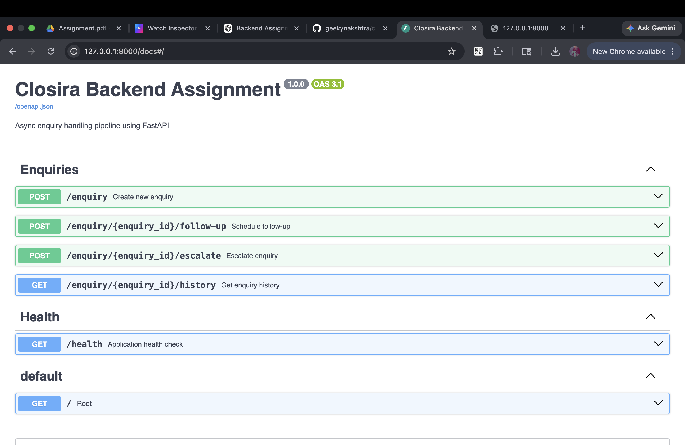
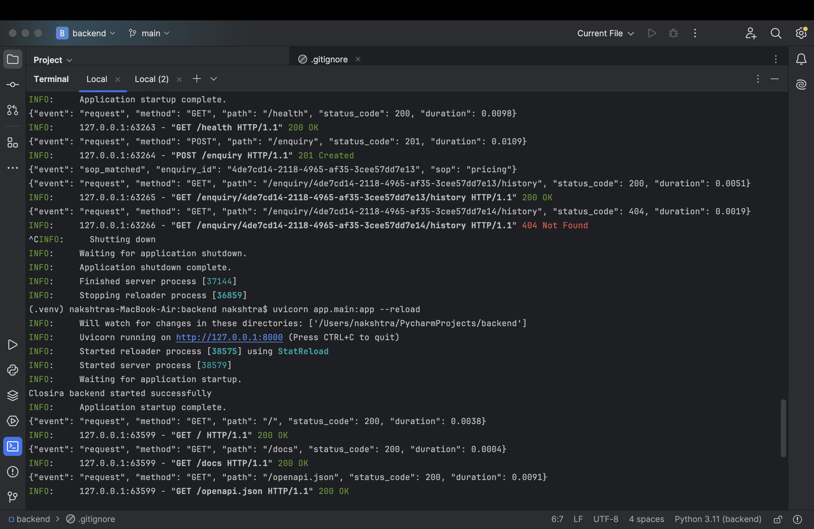
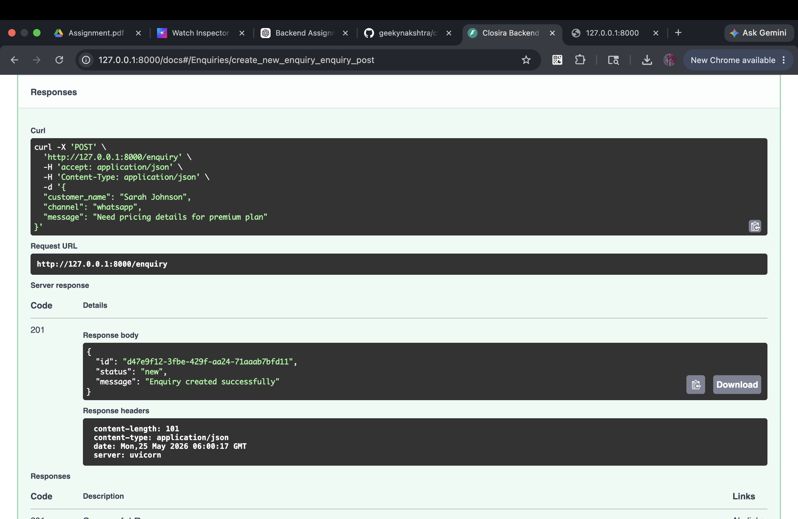

# Closira Backend Assignment

Async customer enquiry handling pipeline built using FastAPI.

---

# Overview

This project simulates the core backend workflow of Closira — an AI-powered customer communication platform for SMBs.

The system accepts inbound customer enquiries from multiple channels such as WhatsApp, Email, and Calls, processes them asynchronously using SOP-based classification logic, schedules follow-ups, supports escalation workflows, and exposes conversation history APIs.

The primary goal of this assignment was to demonstrate:
- REST API design
- Async background processing
- Backend architecture thinking
- Structured logging
- Error handling
- Engineering trade-off decisions

---

# Features

- REST API built with FastAPI
- Async enquiry processing using FastAPI BackgroundTasks
- SOP matching using keyword-based classification
- Escalation workflow support
- Follow-up scheduling
- Structured JSON logging
- Conversation timeline/history tracking
- SQLite persistence using SQLAlchemy ORM
- Global exception handling
- Request logging middleware
- Auto-generated Swagger documentation (`/docs`)
- Docker support

---

# Architecture

Client
  ↓
FastAPI Routes
  ↓
Service Layer
  ↓
Background Worker
  ↓
SOP Matcher
  ↓
SQLite Database

# Project Structure

backend/
│
├── app/
│   ├── core/
│   ├── middleware/
│   ├── models/
│   ├── routes/
│   ├── schemas/
│   ├── services/
│   ├── utils/
│   ├── workers/
│   ├── database.py
│   └── main.py
│
├── requirements.txt
├── Dockerfile
├── sample_requests.http
├── README.md
└── .gitignore

# Tech Stack

Layer	                   Technology

API Framework           	FastAPI
Database                	SQLite
ORM	                        SQLAlchemy
Async Processing	        FastAPI BackgroundTasks
Validation	                Pydantic
Logging                 	Python Logging
Documentation	            Swagger/OpenAPI

-----

Setup Instructions
1. Clone Repository
   git clone <your-github-repository-url>
   cd backend
2. Create Virtual Environment
   
   Mac/Linux
   python -m venv venv
   source venv/bin/activate
 
   Windows
   python -m venv venv
   venv\Scripts\activate

3. Install Dependencies
   pip install -r requirements.txt
4. Run Application
   uvicorn app.main:app --reload 

   Application will run at:
   http://127.0.0.1:8000
   Swagger documentation:
   http://127.0.0.1:8000/docs

   Running with Docker
   Build Docker Image
   docker build -t closira-backend .
   Run Docker Container
   docker run -p 8000:8000 closira-backend

----

# API Endpoints
Method              	Endpoint                               	Description
POST	                /enquiry	                            Create new enquiry
POST	                /enquiry/{id}/follow-up	                Schedule follow-up
POST	                /enquiry/{id}/escalate	                Escalate enquiry
GET	                    /enquiry/{id}/history	                Get enquiry history
GET	                    /health	                                Health check

---
SOP Matching Logic
The system uses simple keyword-based SOP classification logic.

Supported SOPs:

> Pricing enquiries
> Booking enquiries
> Complaint handling
> Support requests
> After-hours messages

If no SOP is matched:

> the enquiry is automatically escalated
> an escalation event is logged
---

Async Processing Workflow
1. Client creates enquiry using /enquiry
2. API stores enquiry immediately
3. API returns response without blocking
4. Background task processes enquiry
5. SOP matcher classifies message
6. Database updates status and suggested response
7. Events are logged into enquiry timeline
---

Structured Logging
The application generates structured JSON logs for:
> enquiry creation
> SOP matching
> escalation events
> request logging
> background task processing

Example log:

JSON

{
  "event": "sop_matched",
  "enquiry_id": "12345",
  "sop": "pricing"
}
---

Database Schema
enquiries

Stores primary enquiry information.
Fields:

> id
> customer_name
> channel
> message
> status
> matched_sop
> suggested_response
> created_at

enquiry_events
Stores enquiry lifecycle timeline events.
Examples:

> enquiry_created
> processing_started
> sop_matched
> escalated
> followup_scheduled

followups
Stores scheduled follow-up tasks.

# Design Decisions

Why SQLite?

SQLite was chosen to keep the prototype lightweight and easy to run locally without requiring external infrastructure setup.
For production-scale systems, PostgreSQL would be preferred for concurrency, reliability, and scalability.

Why FastAPI BackgroundTasks Instead of Celery?
FastAPI BackgroundTasks were selected to keep infrastructure simple for this prototype.
This avoids requiring:

> Redis
> worker containers
> queue orchestration

In production, Celery with Redis/RabbitMQ would be preferred for:

>distributed workers
>retries
>queue durability
>worker scaling

Why Separate Event Timeline Table?
A separate enquiry_events table was introduced to maintain a lifecycle timeline of enquiry actions such as:

> creation
> SOP matching
> escalation
> follow-up scheduling

This improves observability and supports future analytics/audit requirements.

Why Service Layer Architecture?
Business logic was separated from route handlers to:

> improve maintainability
> keep routes lightweight
> support future scaling
> improve code readability

Error Handling
The application includes:

> global exception handling
> request validation handling
> meaningful HTTP status codes
> graceful failure responses

Request Logging Middleware
Custom middleware was added to:

> log incoming requests
> track response status codes
> measure request duration
> improve observability

Known Limitations:

> Uses keyword-based SOP matching instead of AI/NLP
> SQLite is not suitable for highly concurrent production workloads
> BackgroundTasks are process-local
> No authentication or authorization layer
> No tenant isolation
> No retry queue for failed async jobs

Future Improvements:

> Replace BackgroundTasks with Celery + Redis
> Add PostgreSQL support
> Introduce AI-powered enquiry classification
> Add retry queues and dead-letter queues
> Add authentication and RBAC
> Add multi-tenant support
> Add observability with Prometheus/Grafana
> Add automated testing suite
> Add Kafka/event-driven architecture support

API Testing
Sample API requests are included in:
sample_requests.http

Screenshots:

## Swagger Documentation

---

## Terminal Logs

---

## Example API Response

Video Walkthrough
A short walkthrough video explaining:
> architecture
> async workflow
> API endpoints
> design decisions
> trade-offs

is included with the submission.

Author
Nakshatra Tyagi